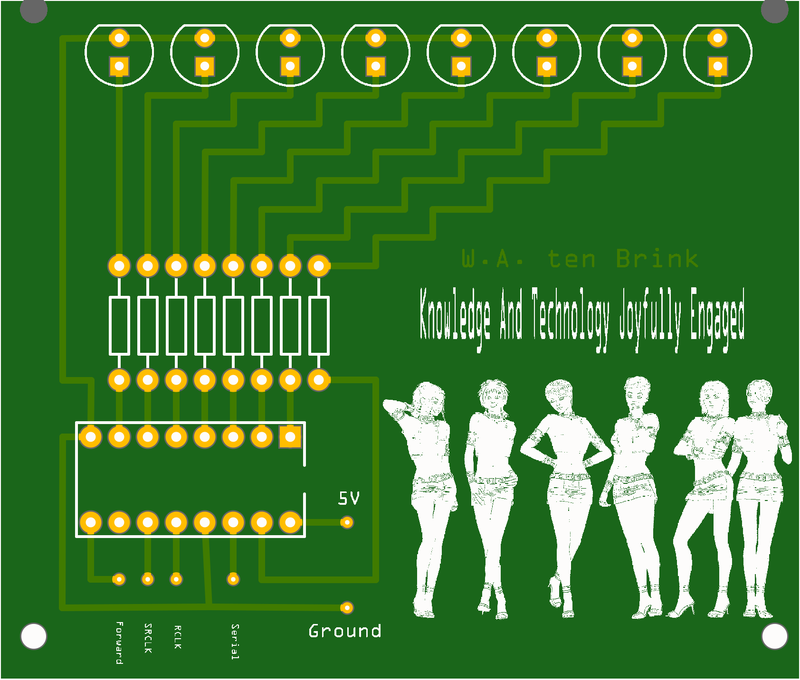
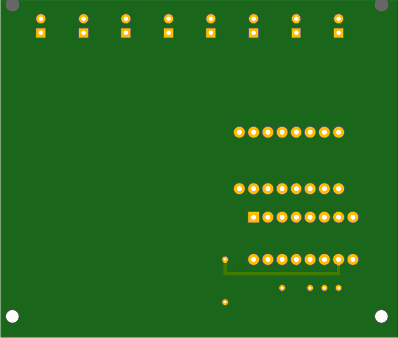

# LED Board

## About This Project

## Renderings

### Top

### Bottom

## BOM

|Count|Component|Details|Datasheet|
|-|-|-|-|
|8x|LED1 / LED2 / LED3 / LED4 / LED5 / LED6 / LED7 / LED8|T-1 3/4 (5 mm), Low Current, Double Heterojunction AlGaAs Red LED Lamps|[Link](http://datasheet.octopart.com/HLMP-D150-Avago-datasheet-10310526.pdf)|
|8x|R1 / R2 / R3 / R4 / R5 / R6 / R7 / R8|SFR25 Series Ø 2.5 x 6.5 mm 0.4 W 220 Ohm ±1 % ±100 ppm/K Metal Film Resistor|[Link](http://datasheet.octopart.com/SFR2500002200FR500-Vishay-datasheet-7601024.pdf)|

---

This project is managed and available on

You can view it [here](https://aisler.net/p/DBRTVFVO). Start your own Powerful Prototype on [here](https://aisler.net).
